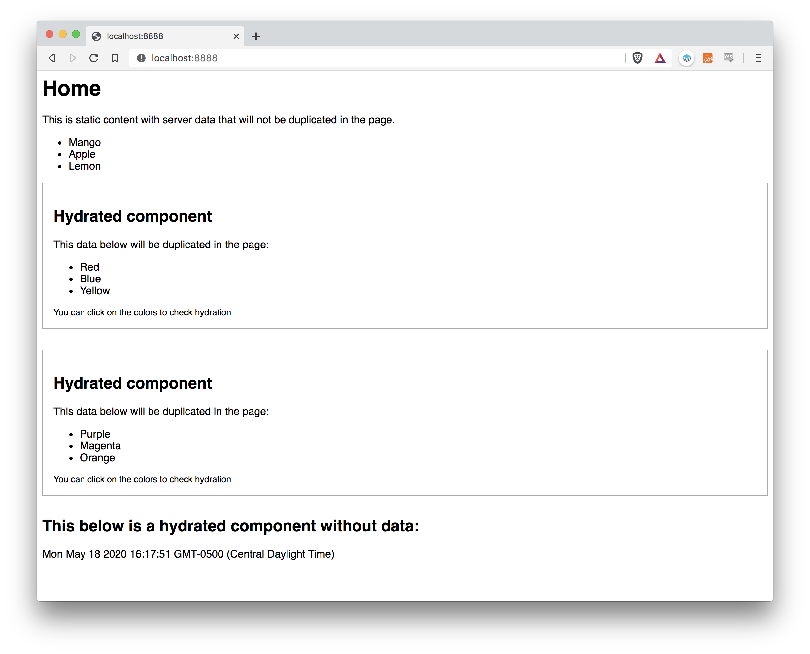
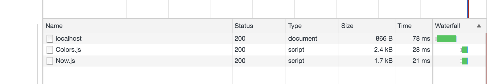

# Svelte SSR partial hydration proof of concept



```
npm install
npm run start
```

## But why?
The major problem when doing SSR is that you will need to ship the DB data two times to the client:

1. In the actual SSR'd HTML code
2. In a JSON object to feed your client-side components

For certain use cases this can be very wasteful.

As an example see [Sapper HN](https://hn.svelte.dev/item/23223335). Right-click, open the source, and scroll to the bottom. There is a **huge** chunk of JSON. This is only an illustrative example though because Sapper only uses SSR in the first request.

If you run this proof of concept and look at the generated source you'll see only the data for the hydrated components is included in the JSON object:
```
const HYDRATION_DATA = {"Colors_1":{"colors":["Red","Blue","Yellow"]},"Colors_2":{"colors":["Purple","Magenta","Orange"]}};
```
Also, only the JavaScript for the hydrated components is loaded:


## Here be dragons

This is a very basic proof of concept and doesn't solve a number of things:
* Dynamically telling Rollup which client-side components it needs to bundle. Just put them all in the same folder and then create an array of Rollup configs.
* Dynamically telling your server which client-side components it must use on each per page.
* Hashes in the component files bundled by Rollup. This can be solved by reading the static folder of `.js` files like I did on my [Svelte SSR example](https://github.com/PierBover/svelte-ssr-example) if your SSR server is running on Node (eg: Heroku). If you are doing SSR serverless you can create a list of the files after Rollup ends up bundling and import/require that in your cloud function.