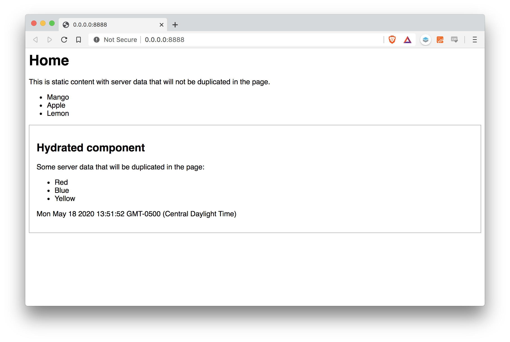

# Svelte SSR partial hydration proof of concept

## But why?
The major problem when doing SSR is that you will need to ship the DB data two times to the client:

1. In the actual SSR'd HTML code
2. In a JSON object to feed your client-side components

For certain use cases this can be very wasteful.

As an example see [Sapper HN](https://hn.svelte.dev/item/23223335). Right-click, open the source, and scroll to the bottom. There is a **huge** chunk of JSON. This is only an illustrative example though because Sapper only uses SSR in the first request.

## Danger

This is a very basic proof of concept and doesn't solve a number of things:
* Everything is hardcoded and works if there is a single instance of every hydratred component. This is ok for my current use case but I'll try to solve this dynamically in a way that there can be multiple instances of the same hydrated component on the same page.
* Dynamically telling Rollup which client-side components it needs to bundle. Just put them all in the same folder and then create an array of Rollup configs.
* Hashes in the component files bundled by Rollup. This can be solved by reading the static folder of `.js` files like I did on my [Svelte SSR example](https://github.com/PierBover/svelte-ssr-example) if your SSR server is running on Node (eg: Heroku). If you are doing SSR serverless you can create a list of the files after Rollup ends up bundling and import/require that in your cloud function.